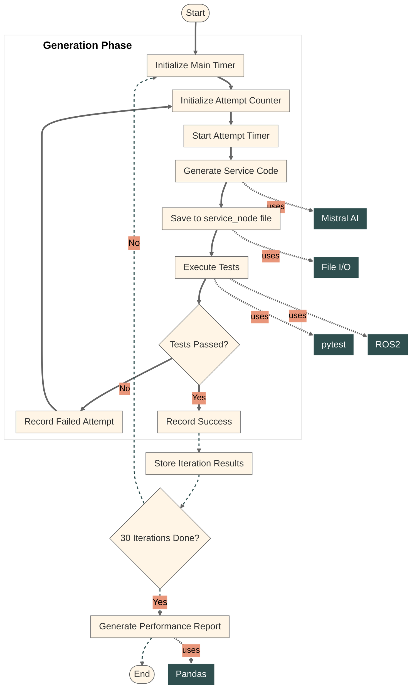

# Codestral ROS2 AI Generator
Generate ROS2 elements (nodes, interfaces, etc) with Codestral AI model

## Generation block diagram

[Mermais flowchart options](https://mermaid.js.org/config/schema-docs/config-defs-flowchart-diagram-config.html#flowchartdiagramconfig-properties)

