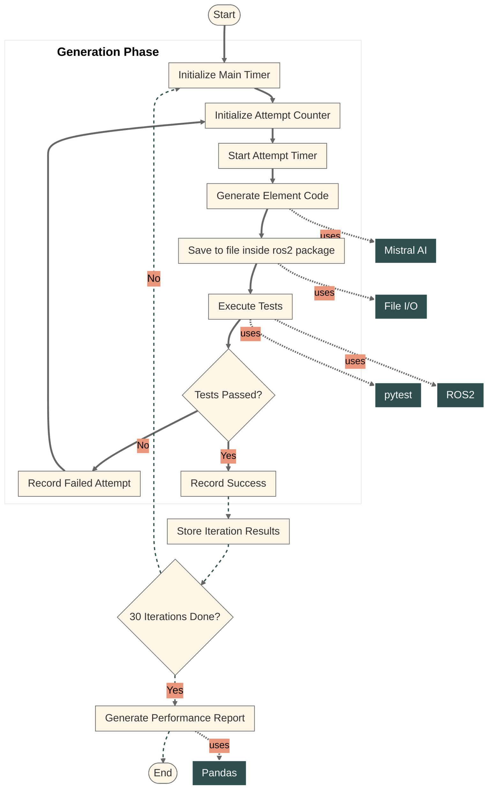

# Codestral ROS2 AI Generator

[](https://github.com/lexmaister/codestral_ros2_gen/blob/main/LICENSE)
[](https://www.linux.org/)
[](https://www.python.org/downloads/)
[](https://docs.ros.org/en/humble/)
[](https://coveralls.io/github/lexmaister/codestral_ros2_gen?branch=main)

Generate ROS2 elements (nodes, interfaces, etc) with Codestral AI model.

This project includes:
- 🛠️ **Generation Tools**: Scripts and utilities for creating ROS2 packages and generating ROS2 elements
- 📊 **Evaluation Tools**: Tools for assessing generation quality and performance metrics
- 💡 **Sample Implementation**: See [Examples](#examples) section for a complete use cases

**Note: This is a personal project I created for learning purposes. Feel free to join my [Telegram channel](https://t.me/ai_code_developer) to follow along and contribute! Licensed under MIT.**

## Installation

* Make a directory for the project and navigate to it:
```bash
mkdir test_gen
cd test_gen
```

* Create a virtual environment:
```bash
python3 -m venv .venv
source .venv/bin/activate
```

* Clone the repository:
```bash
git clone https://github.com/lexmaister/codestral_ros2_gen.git
cd codestral_ros2_gen
```

* Make the scripts executable:
```bash
chmod +x scripts/*
```

* Install the package in the editable mode:
```bash
pip install --upgrade pip
pip install -e .
```

## Usage

To use this project, you need to have ROS2 installed (it was designed for ROS2 Humble). Please refer to the [ROS 2 installation guide](https://docs.ros.org/en/humble/Installation.html) for instructions.

### Examples

To use examples, you also need to create a directory for ros2 workspace `ros2_ws` **near your project directory**:
```bash
mkdir test_ws
```

so your directory structure will look like this:
```
test_gen/
├── .venv/
├── codestral_ros2_gen/
└── test_ws/
```

* [Generating a network scanner node](docs/Example_network_scanner_node.md)
* [Generating a simple service node](docs/Example_object_height_service.md)

## Documentation

### Full Code Documentation

See the [full code documentation](https://lexmaister.github.io/codestral_ros2_gen/) on GitHub Pages. This documentation includes detailed explanations of the codebase, API references, and usage examples.

### Generation and Performance Evaluation Block Diagram



[Mermaid flowchart options and customization](https://mermaid.js.org/config/schema-docs/config-defs-flowchart-diagram-config.html#flowchartdiagramconfig-properties)
