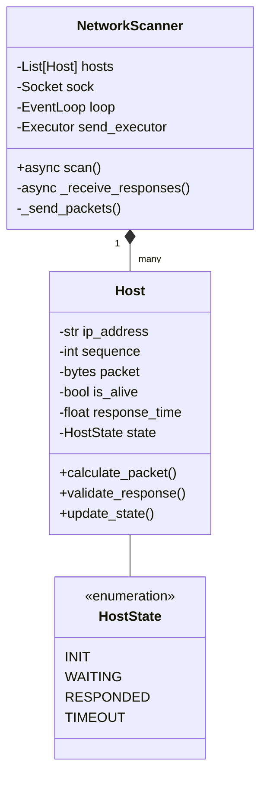
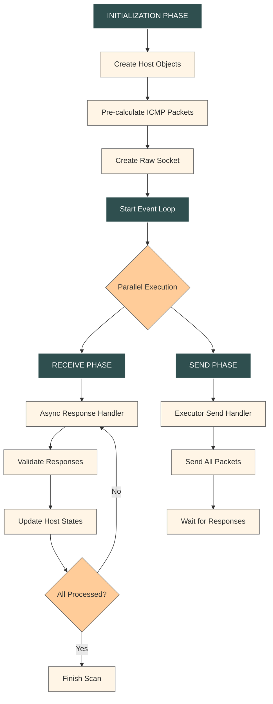

# Example: Network Scanner

<!-- This example demonstrates generating a ROS2 service that calculates real-world object height using camera parameters. -->

## Network Scanner Description
Asynchronous network scanner using ICMP echo requests (ping) with pre-initialized hosts and non-blocking socket operations. Uses hybrid architecture combining synchronous sending and asynchronous receiving.

### Components Structure



### Operational flow



### Component Details

**NetworkScanner**
Purpose: Main coordinator for network scanning operations
Responsibilities:
Host object management
Socket initialization
Event loop coordination
Results collection
Host
Purpose: Encapsulates single target properties and operations
Attributes:
IP address
Sequence number
Pre-calculated packet
Response data
Current state
Methods:
Packet calculation
Response validation
State management
Operational Phases
1. Initialization
Create raw socket (IPPROTO_ICMP)
Initialize host objects
Pre-calculate ICMP packets
Set up async event loop
2. Sending (Synchronous)
Execute in ThreadPoolExecutor
Single batch send operation
No retries
Sequential packet transmission
3. Receiving (Asynchronous)
Non-blocking socket operations
Response matching
Host state updates
Timeout handling
Error Handling
Socket exceptions
Timeout management
Invalid packet detection
Resource cleanup
Performance Considerations
Pre-calculated packets
Batch operations
Minimal state transitions
Efficient memory usage
Thread/async coordination

## Package Structure
ROS2 package structure for the service:
```
object_height/
├── object_height/              # Python package
│   ├── __init__.py
│   └── service_node.py         # Test service implementation for package init
├── srv/
│   └── ObjectHeight.srv        # Service definition
├── test/
│   └── test_service_node.py    # Unit tests
├── CMakeLists.txt              # Build configuration
└── package.xml                 # Package metadata
```

## Example Explanation

**Configuration**:
   - The project uses a configuration file (`config.yaml`) to manage settings for the model, generation, test, metrics collection, output, and input files. You can find this file in the `examples/object_height` directory.

**Generator Script**:
   - The `generator.py` script in the `examples/object_height` directory prepares the prompt, interacts with the AI model, and handles the generation process. This script is the entry point for generating ROS2 service nodes.

**Service Interface and Test Files**:
   - These files are specified in the configuration and are used to construct the prompt for the AI model. You can find them in the `src/object_height/srv` and `src/object_height/test` directories, respectively.

## Setup and Testing (ROS2 Humble)

1. Make setup script executable and run it:
```bash
cd codestral_ros2_gen/scripts
chmod +x setup_pkg.sh
./setup_pkg.sh -p object_height
```

2. Verify the package setup:
```bash
# Navigate to the test_ws directory
cd ../../test_ws
source /opt/ros/humble/setup.bash
source install/setup.bash

# Check if package is installed
ros2 pkg list | grep object_height

# Verify service interface
ros2 interface package object_height

# List available executables
ros2 pkg executables object_height

# Run test service
ros2 run object_height object_height_service
```

4. Open another terminal and test test that service publishes in topic `/service_status`:
``` bash
# Navigate to the test_ws directory
cd test_ws
source /opt/ros/humble/setup.bash
source install/setup.bash
ros2 topic echo /service_status
```

## Generating Service with the Model

### **Configuration File:**

The configuration file (`config.yaml`) defines the input and output paths for the service interface and test files, as well as other parameters for the AI model. Use it to specify Mistral API key and other settings:
```yaml
model:
  api_key: "YOUR_API_KEY_HERE"

generation:
  max_attempts: 10
  evaluation_iterations: 1
```

Follow the following steps to generate the service implementation using the AI model.

### **Generate the Service Implementation:**

Ensure you are in the test workspace directory (e.g., `test_ws`), then execute:
```bash
python3 ../codestral_ros2_gen/examples/object_height/generator.py
```

This command will:
- Load the local configuration from `config.yaml`
- Construct a detailed prompt by reading the service interface and test file (as specified in the input section)
- Use the AI model to create a ROS2 service node implementation
- Save the generated code to the output file defined in the configuration

### **Review the Generation Output:**

The generator will output summary metrics and status messages. Check the console for:
- Success or failure status
- Detailed metrics about generation time, attempt count, and any errors

**Report Example:**
```
2025-03-01 21:57:35,950 - root - INFO - Generation report:
+-----------+---------+----------+--------------+---------------------+------------------+
| iteration | success | attempts | tests_passed | avg attempt time, s | avg total tokens |
+-----------+---------+----------+--------------+---------------------+------------------+
|     1     |   ✅    |    10    |      14      |          7          |       2202       |
+-----------+---------+----------+--------------+---------------------+------------------+
2025-03-01 21:57:35,950 - root - INFO - Phase: REPORT -> Metrics analysis finished.
2025-03-01 21:57:35,950 - root - INFO - Generation process finished in 79 seconds.
```

## Testing the Generated Service

Once the code is generated, test it as described below (ensure you have sourced the ROS2 setup files and the workspace setup files):

- **Start the Service Node:**
  In Terminal 1, run:
  ```bash
  ros2 run object_height object_height_service
  ```

- **Call the Service:**
  In Terminal 2, issue a service call with appropriate parameters:
  ```bash
  ros2 service call /calculate_object_height object_height/srv/ObjectHeight \
  "{focal_length: 35.0, image_height: 1152, pixel_size: 3.45, object_distance: 6.5}"
  ```

## Expected Output

The service call should return a response similar to:
```
waiting for service to become available...
requester: making request: object_height.srv.ObjectHeight_Request(focal_length=35.0, image_height=1152, pixel_size=3.45, object_distance=6.5)

response:
object_height.srv.ObjectHeight_Response(object_height=738.1028442382812, success=True, feedback='Calculation successful.')
```

## Troubleshooting

If the service fails to generate or the output is not as expected, verify:
- **ROS2 Environment:** Ensure you have sourced the ROS2 setup files:
  ```bash
  source /opt/ros/humble/setup.bash
  source install/setup.bash
  ```
- **Package Status:** Confirm the `object_height` package is installed:
  ```bash
  ros2 pkg list | grep object_height
  ```
- **Node and Service Status:** Check active nodes and services:
  ```bash
  ros2 node list
  ros2 service list
  ```
