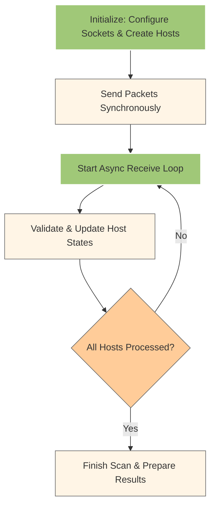

# Example: Network Scanner

<!-- This example demonstrates generating a ROS2 service that calculates real-world object height using camera parameters. -->

## Network Scanner Description

The network scanner initializes both send and receive sockets upfront when entering the scan operation. In the ScanOperation context, hosts are created and both raw sockets are configured to be operational. ICMP echo request packets are sent synchronously using the blocking send socket (_send_packets), ensuring precise control over packet transmission timing. After sending all packets, an asynchronous loop (_collect_responses) is started on the non-blocking receive socket to gather responses, allowing efficient concurrent handling of multiple replies while enforcing a timeout.

### Operational flow



### Component Details

**ScanOperation**
• __Entering the context__: Both send and receive sockets are created and made ready.
• __Synchronous send__: The _send_packets method sends ICMP packets one-by-one, blocking between packets to maintain a controlled sending interval.
• __Asynchronous response collection__: Once sending is complete, _collect_responses uses asyncio and the non-blocking receive socket to handle incoming packets concurrently until timeout.

**NetworkScanner**
• Coordinates multiple scan operations and formats results after the scan completes.

### Example Usage

```python
from network_scanner import NetworkScanner

# Basic scan with results display
scanner = NetworkScanner()
hosts = scanner.scan("192.168.10.0/24")
print(scanner.format_results(hosts, show_all=False))
```

## Package Structure
ROS2 package structure for the network scanner node:
```
network_scanner/
├── network_scanner/          # Python package
│   ├── __init__.py
│   └── scanner_node.py       # Test node for package init
├── msg/
│   ├── IPStatus.msg          # Message for one host
|   └── NetworkStatus.msg     # Message for array of hosts
├── test/
│   └── test_scanner_node.py  # Unit tests
├── CMakeLists.txt            # Build configuration
└── package.xml               # Package metadata
```

## Example Explanation

**Configuration**:
   - The project uses a configuration file (`config.yaml`) to manage settings for the model, generation, test, metrics collection, output, and input files. You can find this file in the `examples/network_scanner` directory.

**Generator Script**:
   - The `generator.py` script in the `examples/network_scanner` directory prepares the prompt, interacts with the AI model, and handles the generation process. This script is the entry point for generating ROS2 service nodes.

**Node Interface and Test Files**:
   - These files are specified in the configuration and are used to construct the prompt for the AI model. You can find them in the `src/network_scanner/msg` and `src/network_scanner/test` directories, respectively.

## Setup and Testing (ROS2 Humble)

1. Make setup script executable and run it:
```bash
cd codestral_ros2_gen/scripts
chmod +x setup_pkg.sh
./setup_pkg.sh -p network_scanner
```

2. Verify the package setup:
```bash
# Navigate to the test_ws directory
cd ../../test_ws
source /opt/ros/humble/setup.bash
source install/setup.bash

# Check if package is installed
ros2 pkg list | grep network_scanner

# Verify service interface
ros2 interface package network_scanner

# List available executables
ros2 pkg executables network_scanner

# Run test service
ros2 run network_scanner network_scanner_node
```

4. Open another terminal and test test that service publishes in topic `/network_status`:
``` bash
# Navigate to the test_ws directory
cd test_ws
source /opt/ros/humble/setup.bash
source install/setup.bash
ros2 topic echo /network_status
```

You should see messages like:
```
stamp:
  sec: 1742381592
  nanosec: 479597767
addresses:
- ip_address: 192.168.1.1
  status: offline
---
```

## Generating Service with the Model

### Permissions for raw socket operations

The network scanner uses raw sockets to send and receive ICMP packets. On Linux, this functionality requires elevated permissions. You can grant these permissions (from your test workspace directory, e.g., `test_ws`) to compiled network scanner's binary by running the following command:

```bash
sudo setcap cap_net_raw+ep ../codestral_ros2_gen/scripts/nscan
```

After setting the necessary permissions, verify that the scanner works correctly by pinging the `8.8.8.8` address with the test script. Run the following command:
```bash
../codestral_ros2_gen/scripts/nscan 8.8.8.8
```

If everything is set up correctly, you should see output similar to:
```
============================= Network Scan Results =============================
IP Address       State      Response Time (ms)   Error
--------------------------------------------------------------------------------
8.8.8.8          UP         0 ms
=================================== Summary ====================================
Total hosts scanned: 1
Hosts up: 1
Hosts down: 0
Hosts with errors: 0
Scan duration: 0.20 seconds
================================================================================
```

To revert the capabilities setting, use the following command:
```bash
sudo setcap -r cap_net_raw+ep ../codestral_ros2_gen/scripts/nscan
```

### **Configuration File:**

The configuration file (`config.yaml`) defines the input and output paths for the service interface and test files, as well as other parameters for the AI model. Use it to specify Mistral API key and other settings:
```yaml
model:
  api_key: "YOUR_API_KEY_HERE"

generation:
  max_attempts: 10
  evaluation_iterations: 1
```

Follow the following steps to generate the service implementation using the AI model.

### **Generate the Service Implementation:**

Ensure you are in the test workspace directory (e.g., `test_ws`), then execute:
```bash
python3 ../codestral_ros2_gen/examples/network_scanner/generator.py
```

This command will:
- Load the local configuration from `config.yaml`
- Construct a detailed prompt by reading the messages and test files (as specified in the input section)
- Use the AI model to create a ROS2 node implementation
- Save the generated code to the output file defined in the configuration

<!-- STOP HERE -->

### **Review the Generation Output:**

The generator will output summary metrics and status messages. Check the console for:
- Success or failure status
- Detailed metrics about generation time, attempt count, and any errors

**Report Example:**
```
2025-03-01 21:57:35,950 - root - INFO - Generation report:
+-----------+---------+----------+--------------+---------------------+------------------+
| iteration | success | attempts | tests_passed | avg attempt time, s | avg total tokens |
+-----------+---------+----------+--------------+---------------------+------------------+
|     1     |   ✅    |    10    |      14      |          7          |       2202       |
+-----------+---------+----------+--------------+---------------------+------------------+
2025-03-01 21:57:35,950 - root - INFO - Phase: REPORT -> Metrics analysis finished.
2025-03-01 21:57:35,950 - root - INFO - Generation process finished in 79 seconds.
```

## Testing the Generated Service

Once the code is generated, test it as described below (ensure you have sourced the ROS2 setup files and the workspace setup files):

- **Start the Service Node:**
  In Terminal 1, run:
  ```bash
  ros2 run object_height object_height_service
  ```

- **Call the Service:**
  In Terminal 2, issue a service call with appropriate parameters:
  ```bash
  ros2 service call /calculate_object_height object_height/srv/ObjectHeight \
  "{focal_length: 35.0, image_height: 1152, pixel_size: 3.45, object_distance: 6.5}"
  ```

## Expected Output

The service call should return a response similar to:
```
waiting for service to become available...
requester: making request: object_height.srv.ObjectHeight_Request(focal_length=35.0, image_height=1152, pixel_size=3.45, object_distance=6.5)

response:
object_height.srv.ObjectHeight_Response(object_height=738.1028442382812, success=True, feedback='Calculation successful.')
```

## Troubleshooting

If the service fails to generate or the output is not as expected, verify:
- **ROS2 Environment:** Ensure you have sourced the ROS2 setup files:
  ```bash
  source /opt/ros/humble/setup.bash
  source install/setup.bash
  ```
- **Package Status:** Confirm the `object_height` package is installed:
  ```bash
  ros2 pkg list | grep object_height
  ```
- **Node and Service Status:** Check active nodes and services:
  ```bash
  ros2 node list
  ros2 service list
  ```
